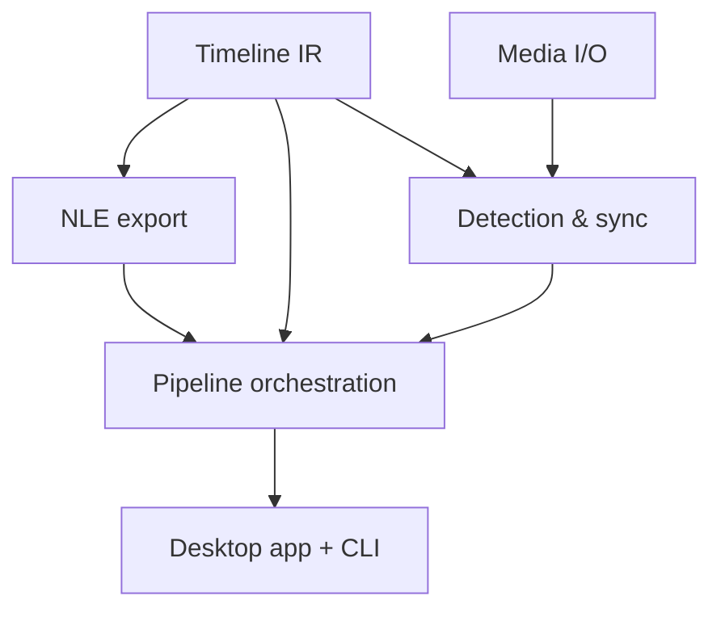

# Hollywood — Roadmap

How Hollywood gets built, as goal-oriented **epics** ordered by priority. The
first epic is always the next thing to implement. Each epic states _why_ it
matters before _what_ it contains. See [SPEC.md](./SPEC.md) for the technical
detail behind these.

Work lands as small, stacked draft PRs (500–1000 lines each); every PR closes a
problem-only issue and ticks its box here on the PR itself.

## Dependency overview

Independent streams that can progress in parallel once the **Timeline IR**
lands: **NLE export**, **Media I/O**, and (after Media I/O) **Detection &
sync**. They converge at **Pipeline orchestration**, which the **Desktop app**
drives.

## Timeline IR

**Goal:** establish the shared vocabulary every other crate speaks. Until the IR
exists, nothing else can be built against it, so it is the gate for the whole
project. The IR must make invalid timelines unrepresentable (no negative
durations, no clip outside its source, exact rational time) and be cheap to
construct and inspect in tests.

Delivered by #7 (#8).

- [x] `crates/timeline`: rational time / time range, frame & sample rate
      newtypes
- [x] Timeline → tracks → clips/gaps; media-asset identity and relinking
- [x] Transition model (hard cut + audio cross-fade), constructed only in valid
      positions
- [x] Property-based tests for the invariants

## NLE export

**Goal:** the differentiator and the highest-risk subsystem — a timeline is
worthless if it won't open in the editor's NLE. Get a hard-cut **xmeml** export
opening natively in _both_ Premiere and Resolve, proven by golden files, before
attempting transitions or FCPXML.

- [x] `crates/hollywood-nle`: golden-file test harness
- [x] FCP7 **xmeml** writer — multi-track, hard cuts (implemented; golden-file
      regression harness only — Premiere/Resolve import not yet validated)
- [x] **FCPXML** writer — Final Cut / Resolve, explicit audio channel sources
      (implemented; golden-file regression harness only — Final Cut/Resolve
      import not yet validated) —
      [#37](https://github.com/dataclique/hollywood/issues/37)
      ([#38](https://github.com/dataclique/hollywood/pull/38))
- [x] Audio cross-fade — FCP7 **xmeml** centered `transitionitem` (primary
      format; golden-file regression harness only — real Premiere/Resolve import
      not yet validated) —
      [#51](https://github.com/dataclique/hollywood/issues/51)
      ([#52](https://github.com/dataclique/hollywood/pull/52))
- [ ] Audio cross-fade — **FCPXML** (Final Cut / Resolve), validated against a
      real import — [#31](https://github.com/dataclique/hollywood/issues/31)
- [ ] Optional `.otio` export via native `serde_json` against a pinned schema

## Media I/O

**Goal:** read real media reproducibly. Detection and sync are meaningless
without correct durations, sample rates, and decoded audio. Proving the FFmpeg
link and probe path early (already partly de-risked in the foundation) unblocks
the two analysis crates.

- [x] `crates/ffmpeg`: probe (duration, fps, sample rate, channels) behind a
      narrow trait
- [x] Decode audio to mono sample buffers for analysis —
      [#39](https://github.com/dataclique/hollywood/issues/39)
      ([#40](https://github.com/dataclique/hollywood/pull/40))
- [ ] Fixture media + tests; keep the trait backend-swappable (Symphonia
      fallback)

## Detection & sync

**Goal:** the actual automation — decide what to keep and align the audio. This
is where Hollywood earns its name. Depends on Media I/O (decoded audio) and the
Timeline IR (to express keep/cut regions and offsets).

- [x] `crates/hollywood-detect`: RMS silence gating → keep/cut regions with
      padding — [#41](https://github.com/dataclique/hollywood/issues/41)
      ([#42](https://github.com/dataclique/hollywood/pull/42))
- [ ] Silero VAD via `ort` for non-speech detection; `webrtc-vad` fallback
- [x] `crates/hollywood-sync`: cross-correlation alignment (`rustfft`/`realfft`)
      — [#43](https://github.com/dataclique/hollywood/issues/43)
      ([#44](https://github.com/dataclique/hollywood/pull/44))
- [x] GCC-PHAT as an opt-in strategy —
      [#45](https://github.com/dataclique/hollywood/issues/45)
      ([#46](https://github.com/dataclique/hollywood/pull/46))
- [ ] Piecewise drift map for long recordings

## Pipeline orchestration

**Goal:** wire the stages into one reproducible, restart-safe pipeline so the
app and CLI drive the same code. Depends on everything above.

- [x] `crates/hollywood-pipeline` orchestration skeleton: ordered stages,
      fail-fast sequencing, and the own progress channel (apalis tracks state,
      not percent) — [#47](https://github.com/dataclique/hollywood/issues/47)
      ([#48](https://github.com/dataclique/hollywood/pull/48))
- [ ] Durable apalis-SQLite backend behind the abstract job interface (tokio
      fallback); WAL + `busy_timeout`
- [ ] Stage chain: wire probe → detect → sync → assemble IR → export

## Desktop app + CLI

**Goal:** make it usable — pick footage, watch progress, choose export targets.
The single deliverable a user touches.

- [x] `egui`/`eframe` (wgpu) shell: file pickers (`rfd` on a worker thread),
      footage list with probe summaries, export target checkboxes, stub progress
      — _in progress_
- [ ] CLI surface over the same pipeline for batch/headless use
- [ ] Packaging/notarization per OS with FFmpeg LGPL notices

## Audio post-processing

**Goal:** make the rough cut comfortable to listen to without manual
gain-riding. Corrective loudness, EQ, dynamics, and ducking so the editor
inherits a level, balanced mix instead of raw per-clip levels — the audio
counterpart to trimming dead air. Rendered to stems rather than fragile
NLE-native filters ([ADR 0006](./adrs/0006-audio-post-processing-stems.md),
[SPEC §5.8](./SPEC.md)). Depends on decoded audio and the assembled timeline;
**post-MVP**, lower priority than the core detect → sync → export pipeline.

Tracked in [#32](https://github.com/dataclique/hollywood/issues/32) — sub-issues
#19 (IR vocabulary), #20 (R128 loudness + normalize), #21 (auto-EQ), #22
(dynamics), #23 (sidechain ducking), #24 (pipeline `process`/stems stage). Audio
cross-fade export is [#31](https://github.com/dataclique/hollywood/issues/31),
under NLE export above.

## Auto-framing & motion

**Goal:** add the camera moves an editor would otherwise keyframe by hand — zoom
onto the part of the frame that matters, and a slow Ken Burns drift across long,
static shots — so a flat assembly already has life. Emitted as native keyframed
transforms, never baked video
([ADR 0007](./adrs/0007-auto-framing-native-transforms.md),
[SPEC §5.9](./SPEC.md)). Needs a new video-frame decode capability and
keyframed-transform export (higher-risk, like cross-fades); **post-MVP**.

Tracked in [#33](https://github.com/dataclique/hollywood/issues/33) — sub-issues
#25 (video frame decode), #26 (IR transform/keyframes), #27 (NLE transform
export), #28 (activity map), #29 (zoom planning), #30 (pipeline `reframe`
stage).

## Not epic

- [ ] GitButler stack-footer tooling (`gitbutler-stack` / `pr-stack-footer`)
      ported from the house template
- [ ] Multicam (`<mc-clip>`) export
- [ ] CI golden-file checks against real Resolve/Premiere installs
- [x] Glossary catch-up for recent domain terms —
      [#49](https://github.com/dataclique/hollywood/issues/49)
      ([#50](https://github.com/dataclique/hollywood/pull/50))

## Completed: Foundation

- [x] Nix + Rust build foundation — #1 (#2)
- [x] AI-agent + contributor governance and skill wiring — #3 (#4)
- [ ] Spec, roadmap, glossary, and ADRs — _(this PR)_
