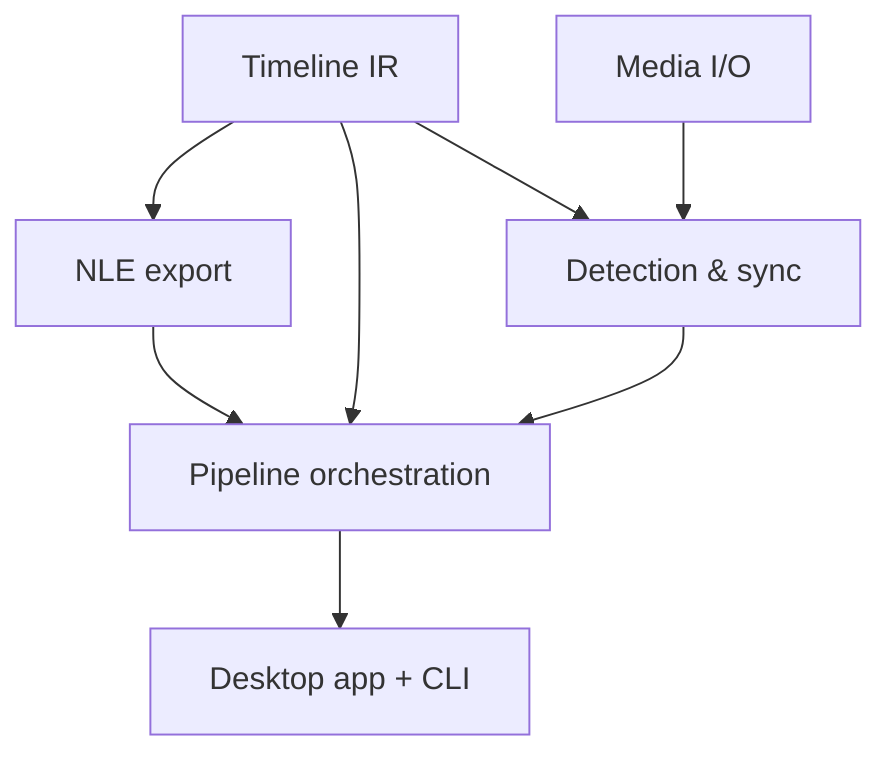

# Hollywood — Roadmap

How Hollywood gets built, as goal-oriented **epics** ordered by priority. The
first epic is always the next thing to implement. Each epic states _why_ it
matters before _what_ it contains. See [SPEC.md](./SPEC.md) for the technical
detail behind these.

Work lands as small, stacked draft PRs (500–1000 lines each); every PR closes a
problem-only issue and ticks its box here on the PR itself.

## Dependency overview

Independent streams that can progress in parallel once the **Timeline IR**
lands: **NLE export**, **Media I/O**, and (after Media I/O) **Detection &
sync**. They converge at **Pipeline orchestration**, which the **Desktop app**
drives.

## Timeline IR

**Goal:** establish the shared vocabulary every other crate speaks. Until the IR
exists, nothing else can be built against it, so it is the gate for the whole
project. The IR must make invalid timelines unrepresentable (no negative
durations, no clip outside its source, exact rational time) and be cheap to
construct and inspect in tests.

Delivered by #7 (#8).

- [x] `crates/timeline`: rational time / time range, frame & sample rate
      newtypes
- [x] Timeline → tracks → clips/gaps; media-asset identity and relinking
- [x] Transition model (hard cut + audio cross-fade), constructed only in valid
      positions
- [x] Property-based tests for the invariants

## NLE export

**Goal:** the differentiator and the highest-risk subsystem — a timeline is
worthless if it won't open in the editor's NLE. Get a hard-cut **xmeml** export
opening natively in _both_ Premiere and Resolve, proven by golden files, before
attempting transitions or FCPXML.

- [ ] `crates/hollywood-nle`: golden-file test harness
- [ ] FCP7 **xmeml** writer — multi-track, hard cuts (primary Premiere+Resolve
      path)
- [ ] **FCPXML** writer — Final Cut / Resolve, explicit audio channel sources
- [ ] Audio cross-fade transitions (separate, validated against real imports)
- [ ] Optional `.otio` export via native `serde_json` against a pinned schema

## Media I/O

**Goal:** read real media reproducibly. Detection and sync are meaningless
without correct durations, sample rates, and decoded audio. Proving the FFmpeg
link and probe path early (already partly de-risked in the foundation) unblocks
the two analysis crates.

- [ ] `crates/hollywood-ffmpeg`: probe (duration, fps, sample rate, channels)
      behind a narrow trait
- [ ] Decode audio to mono sample buffers for analysis
- [ ] Fixture media + tests; keep the trait backend-swappable (Symphonia
      fallback)

## Detection & sync

**Goal:** the actual automation — decide what to keep and align the audio. This
is where Hollywood earns its name. Depends on Media I/O (decoded audio) and the
Timeline IR (to express keep/cut regions and offsets).

- [ ] `crates/hollywood-detect`: RMS/peak silence gating → keep/cut regions with
      padding
- [ ] Silero VAD via `ort` for non-speech detection; `webrtc-vad` fallback
- [ ] `crates/hollywood-sync`: cross-correlation alignment (`rustfft`/`realfft`)
- [ ] GCC-PHAT as opt-in strategy; piecewise drift map for long recordings

## Pipeline orchestration

**Goal:** wire the stages into one reproducible, restart-safe pipeline so the
app and CLI drive the same code. Depends on everything above.

- [ ] `crates/hollywood-pipeline`: abstract job interface (apalis-SQLite
      default, tokio fallback)
- [ ] Stage chain: probe → detect → sync → assemble IR → export
- [ ] Own progress channel (apalis tracks state, not percent); WAL +
      `busy_timeout`

## Desktop app + CLI

**Goal:** make it usable — pick footage, watch progress, choose export targets.
The single deliverable a user touches.

- [ ] `egui`/`eframe` (wgpu) shell: file pickers (`rfd` async), progress, export
      targets
- [ ] CLI surface over the same pipeline for batch/headless use
- [ ] Packaging/notarization per OS with FFmpeg LGPL notices

## Not epic

- [ ] GitButler stack-footer tooling (`gitbutler-stack` / `pr-stack-footer`)
      ported from the house template
- [ ] Multicam (`<mc-clip>`) export
- [ ] CI golden-file checks against real Resolve/Premiere installs

## Completed: Foundation

- [x] Nix + Rust build foundation — #1 (#2)
- [x] AI-agent + contributor governance and skill wiring — #3 (#4)
- [ ] Spec, roadmap, glossary, and ADRs — _(this PR)_
